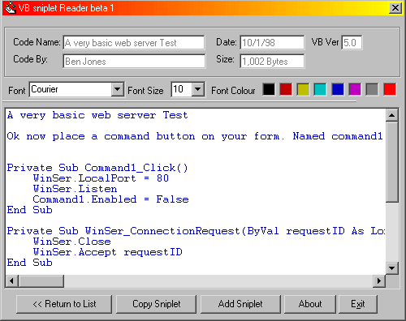



## VB Coder Reader Beta 1

### Description

This is a program I made couse I was fed up with haveing vb code in text files on my desktop all the time. and loseing them. Well if you have ever seen the ABC Reader for Qbasic then you might know what this program is for.

Anyway Ihave also include an Editor in the program and all the code has been commented so it will be quit easy to follew. Ok hope you like it any way please vote if you do. Oh sooy about the screen shot. been to small
 
### More Info
 

             |
---                |---
**Submitted On**   |2000-10-01 22:43:40
**By**             |[dreamvb](https://github.com/Planet-Source-Code/PSCIndex/blob/master/ByAuthor/dreamvb.md)
**Level**          |Advanced
**User Rating**    |4.4 (22 globes from 5 users)
**Compatibility**  |VB 5\.0, VB 6\.0
**Category**       |[Complete Applications](https://github.com/Planet-Source-Code/PSCIndex/blob/master/ByCategory/complete-applications__1-27.md)
**World**          |[Visual Basic](https://github.com/Planet-Source-Code/PSCIndex/blob/master/ByWorld/visual-basic.md)
**Archive File**   |[CODE\_UPLOAD103371012000\.zip](https://github.com/Planet-Source-Code/dreamvb-vb-coder-reader-beta-1__1-11816/archive/master.zip)

